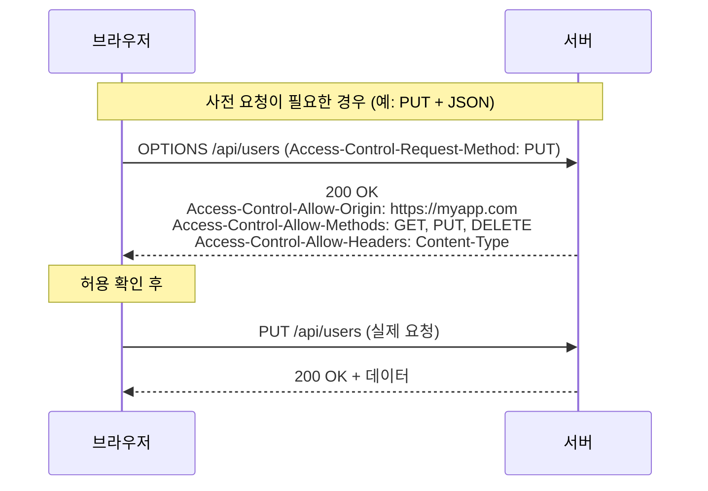

## CORS는 왜 막고, 무엇으로 푸는가

> 프론트엔드 개발 중 누구나 한 번은 마주치는 빨간 콘솔 메시지의 정체 · 대상: 백엔드를 처음 다루는 프론트엔드 개발자

> [!quote] 핵심 메시지
> CORS는 차단하는 규칙이 아니라, 차단을 풀기 위한 약속이다. 막고 있는 진짜 주체는 **동일 출처 정책(SOP)**이며, CORS는 서버가 응답 헤더를 통해 "이 응답은 어떤 출처의 스크립트가 읽어도 좋다"고 표시하면, 브라우저가 그 표시를 보고 응답을 통과시키는 표준 메커니즘이다.

프론트엔드를 만들어 외부 API를 호출했더니 콘솔에 `blocked by CORS policy`라는 빨간 메시지가 뜬다. 그런데 백엔드를 직접 만들어 본 적이 없는 입장에서는 의문이 꼬리를 문다. 왜 브라우저가 멋대로 요청을 막는가? 막는다면 왜 어떤 요청은 통과하는가? 그리고 흔히 말하는 "API 서버를 만들어 미들웨어로 해결하라"는 조언에서 미들웨어·라우터·라우트 핸들러는 각각 무엇을 하는 부품인가? 이 질문들을 차례로 따라가면 웹 백엔드의 기본 골격이 자연스럽게 드러난다.

---

## 1. 막는 것은 CORS가 아니라 동일 출처 정책이다

가장 먼저 바로잡아야 할 오해는 "CORS가 요청을 막는다"는 표현이다. 실제로 막고 있는 것은 **동일 출처 정책(Same-Origin Policy, SOP)** 이라는, 브라우저에 내장된 더 근본적인 보안 정책이다. SOP는 "브라우저에서 실행되는 스크립트는 자신이 로드된 출처와 다른 출처의 응답을 자유롭게 읽을 수 없다"고 못 박는다. 악의적인 사이트가 사용자의 인증 쿠키를 이용해 다른 사이트의 데이터를 몰래 가져가는 것을 원천적으로 차단하기 위함이다.

여기서 **출처(Origin)** 는 다음 세 요소의 조합으로 정의된다.

| 구성 요소 | 의미 | 다른 출처가 되는 예 |
|------------|------|------------------------|
| 스킴(scheme) | 통신 프로토콜 | `http://example.com` ↔ `https://example.com` |
| 호스트(host) | 도메인 + 서브도메인 | `example.com` ↔ `api.example.com` |
| 포트(port) | 접속 포트 | `localhost:5173` ↔ `localhost:3000` |

세 요소 중 하나라도 다르면 브라우저는 즉시 "다른 출처"로 판정한다. 로컬 개발 환경에서 프론트엔드(`localhost:5173`)와 백엔드(`localhost:3000`)가 부딪히는 것도, 같은 회사의 `www.example.com`과 `api.example.com`이 부딪히는 것도 모두 같은 이유다.

> [!warning] 흔한 오해 바로잡기
> "CORS 때문에 막혔다"는 말은 일상적으로 통용되지만, 정확히는 ==SOP가 막고 있고, 그 제약을 풀어주는 약속이 CORS==다. CORS(Cross-Origin Resource Sharing)는 "다른 출처 자원의 공유"라는 이름 그대로, 차단을 푸는 쪽의 표준이다.

그렇다면 어떻게 풀 수 있을까? 결정권은 ==출처가 아닌, 요청을 받는 서버==에게 있다.

---

## 2. 서버가 "허용한다"고 말하는 방법: 응답 헤더

CORS의 핵심 아이디어는 단순하다. 서버가 응답을 보낼 때 "이 출처에서 오는 요청은 받아들이겠다"는 메시지를 함께 첨부하는 것이다. 이 메시지가 담기는 곳이 바로 **HTTP 응답 헤더(Response Header)** 다. 헤더는 본문(데이터) 앞에 붙는 메타정보로, 우편물의 봉투에 적힌 발신·수신 정보와 같은 역할을 한다.

```
[요청]   GET /api/users HTTP/1.1
         Host: api.example.com
         Origin: https://myapp.com         ← 브라우저가 알려주는 "내 출처"

[응답]   HTTP/1.1 200 OK
         Content-Type: application/json
         Access-Control-Allow-Origin: https://myapp.com   ← 서버의 허용 선언

         {"users": [...]}
```

브라우저는 응답이 도착하면 본문보다 먼저 헤더를 읽는다. `Access-Control-Allow-Origin`에 자신의 출처가 적혀 있으면 "이 서버가 허락했구나" 하고 응답을 스크립트에 넘겨준다. 헤더가 없거나 다른 출처가 적혀 있으면 응답은 이미 도착했더라도 폐기된다.

> [!important] 핵심 정리
> CORS 해결의 본질은 ==서버가 응답 헤더를 통해 신뢰를 명시적으로 표시하는 것==이다. 클라이언트가 할 수 있는 일은 없으며, 결정은 전적으로 서버 쪽에 있다.

그런데 이게 전부가 아니다. 브라우저는 어떤 요청에 대해서는, 본 요청을 보내기 전에 "보내도 되는지"를 미리 물어본다.

---

## 3. 단순 요청과 사전 요청(Preflight)

원문이 다루지 않은 중요한 보충 지점이다. CORS 요청은 두 종류로 나뉜다.

| 구분 | 조건 | 동작 |
|------|------|------|
| 단순 요청(Simple) | `GET`·`HEAD`·`POST` 중 하나이고, 표준 헤더만 사용하며, `Content-Type`이 `text/plain`·`application/x-www-form-urlencoded`·`multipart/form-data` 중 하나일 때 | 본 요청을 곧바로 보내고, 응답 헤더로 허용 여부를 판단 |
| 사전 요청(Preflight) | 위 조건을 벗어나는 모든 요청 (예: `PUT`·`DELETE`, `Content-Type: application/json`, 커스텀 헤더 등) | 본 요청 전에 `OPTIONS` 메서드로 "이 요청을 보내도 되는가?"를 먼저 물어보고, 허용 응답을 받은 뒤에야 본 요청을 보냄 |



따라서 서버는 단순 요청을 위한 `Access-Control-Allow-Origin`뿐 아니라, 사전 요청에 응답하기 위한 `Access-Control-Allow-Methods`와 `Access-Control-Allow-Headers`도 함께 내려주어야 한다. 인증 쿠키를 함께 보내는 요청이라면 `Access-Control-Allow-Credentials: true`까지 필요하며, 이 경우 `Allow-Origin`을 와일드카드 `*`로 둘 수 없다는 제약도 따라온다.

> [!info] 왜 사전 요청이 필요한가
> 한 번의 본 요청만으로 데이터가 변경되거나 삭제되는 사고를 막기 위해서다. 위험할 수 있는 요청은 ==보내기 전에 허락을 먼저 받는다==는 안전장치인 셈이다.

이렇게 헤더를 일일이 챙기는 일은 누가 담당할까? 모든 요청 처리 함수가 매번 직접 챙긴다면 코드는 금세 어지러워진다. 여기서 미들웨어가 등장한다.

---

## 4. 누가 헤더를 붙이는가: 미들웨어·라우터·라우트 핸들러

CORS 헤더를 자동으로 챙겨주는 것은 백엔드 서버의 **미들웨어(Middleware)** 라는 부품이다. 그리고 미들웨어를 이해하려면 함께 등장하는 라우터·라우트 핸들러까지 한 묶음으로 보아야 한다.

#### 세 부품의 역할 분담

| 부품 | 역할 | 비유 |
|------|------|------|
| 미들웨어(Middleware) | 요청이 최종 처리자에게 가기 전후에 끼어들어 공통 작업 수행 (CORS 헤더 추가, 인증 검사, 로그 기록 등) | 공장 컨베이어 벨트 위 각 공정 |
| 라우터(Router) | 들어온 요청의 경로(URL)와 메서드(GET·POST 등)를 보고 어느 핸들러에 보낼지 분배하는 ==전체 시스템== | 전화 교환대 |
| 라우트 핸들러(Route Handler) | 특정 경로·메서드 한 쌍에 대응하여 실제 비즈니스 로직을 수행하고 응답을 만드는 ==개별 함수== | 전화를 받아 업무를 처리하는 담당자 |

라우터와 라우트 핸들러는 자주 혼동되지만, ==라우터는 분배 시스템이고 라우트 핸들러는 분배의 종착지==라는 점을 기억하면 헷갈리지 않는다. 즉 라우터는 핸들러를 다른 서버로 전달하는 게 아니라, 같은 서버 안에서 적절한 함수에 연결할 뿐이다. 실제 데이터 처리와 응답 생성은 핸들러가 직접 끝낸다.

#### 한 요청이 거치는 흐름


CORS 미들웨어는 일반적으로 라우터보다 ==앞 단계==에 등록된다. 그래야 어떤 경로로 요청이 가든 응답에 일관되게 헤더가 붙기 때문이다. 또한 사전 요청(`OPTIONS`)을 가로채 본 라우터까지 가지 않고도 즉시 응답해 줄 수 있다.

> [!tip] 실무 팁
> Node.js/Express 환경에서는 직접 만들 필요 없이 ==`cors` npm 패키지를 설치해 한 줄로 등록==하는 것이 표준이다. `app.use(cors({ origin: 'https://myapp.com', credentials: true }))` 같은 형태로 허용 출처와 쿠키 동반 여부를 옵션으로 지정한다.

이제 마지막 의문이 남는다. 개발 중에는 백엔드 코드를 한 줄도 짜지 않았는데도 외부 API를 잘 불러왔다. 그건 어떻게 가능했을까?

---

## 5. 개발용 프록시의 진짜 동작과 한계

원문에서 가장 보완이 필요한 지점이다. 흔히 "Vite 프록시가 응답에 CORS 헤더를 붙여서 돌려준다"고 설명하지만 이는 정확하지 않다. ==개발 서버 프록시는 헤더를 추가하지 않는다==. 대신 요청 자체를 동일 출처에서 받게 만들어 **CORS 검사가 발생할 여지 자체를 없앤다**.

#### 프록시가 실제로 하는 일

```
[브라우저 → 같은 출처 요청]
GET http://localhost:5173/api/users
        │
        ▼
[Vite 개발 서버: 요청 가로챔]
        │  서버↔서버 통신 (CORS 무관)
        ▼
[외부 API]
GET https://api.external.com/users
        │
        ▼
[Vite 개발 서버: 받은 응답을 그대로 전달]
        │
        ▼
[브라우저: 동일 출처 응답으로 인식 → CORS 검사 자체가 없음]
```

핵심은 **CORS는 브라우저↔서버 통신에만 적용되고, 서버↔서버 통신에는 적용되지 않는다**는 점이다. 프록시는 이 비대칭을 활용해 브라우저를 속이는 것이 아니라, 정직하게 동일 출처를 만들어 준다.

> [!failure] Before — 프록시 없이 직접 호출
> 브라우저가 `https://myapp.com`에서 `https://api.other.com`으로 직접 요청 → 다른 출처 → ==SOP에 의해 응답 차단==

> [!success] After — 개발 서버 프록시 경유
> 브라우저가 `localhost:5173/api/users`로 요청 → 같은 출처 → SOP 통과 → Vite가 외부 API에 서버 간 통신으로 전달 → 응답 받아 브라우저에 그대로 반환

> [!warning] 프록시의 결정적 한계
> 프록시는 ==개발용 서버가 띄워져 있을 때만 작동==한다. 빌드 후 정적 파일로 배포하면 프록시 서버는 사라지고, 브라우저는 다시 외부 API에 직접 요청을 보내야 한다. 결국 운영 환경에서는 자체 백엔드 서버에 CORS 미들웨어를 두거나, 백엔드가 외부 API를 대신 호출하는 구조로 바꾸는 등 ==근본적인 해결책==이 필요하다.

이 한계를 이해하고 나면, 왜 많은 글이 "API 서버를 직접 만들라"고 권하는지가 분명해진다. 개발 중의 편의는 잠깐의 임시방편일 뿐이고, 배포된 앱이 외부 API를 안정적으로 다루려면 결국 자기 출처에서 응답해 줄 수 있는 서버가 있어야 하기 때문이다.

---

## 핵심 개념 정리

| 개념 | 의미 | 일상적 비유 |
|------|------|------------|
| 동일 출처 정책(SOP) | 다른 출처의 응답을 스크립트가 읽지 못하게 막는 브라우저 기본 정책 | 다른 회사 우편물을 직원이 함부로 열어볼 수 없는 사내 규정 |
| CORS | SOP의 제약을 안전하게 푸는 표준 메커니즘 | "이 회사 사람이면 우편물 열람 가능"이라고 도장 찍어 둔 허가증 |
| 출처(Origin) | 스킴 + 호스트 + 포트의 조합 | 회사명 + 부서명 + 층수가 모두 일치해야 같은 사무실 |
| 사전 요청(Preflight) | 위험할 수 있는 요청 전에 `OPTIONS`로 미리 묻는 절차 | 큰 가구를 옮기기 전 관리실에 문의하는 것 |
| 응답 헤더 | 본문 앞에 붙는 메타정보 | 우편 봉투에 적힌 발신·수신 정보 |
| 미들웨어 | 요청·응답 사이에서 공통 작업을 수행하는 중간 처리 함수 | 컨베이어 벨트 위의 각 공정 |
| 라우터 | 요청을 적절한 핸들러로 분배하는 시스템 | 전화 교환대 |
| 라우트 핸들러 | 경로·메서드별 실제 처리 함수 | 전화를 받아 업무를 처리하는 담당자 |
| 개발용 프록시 | 같은 출처로 요청을 받아 외부 서버에 대신 전달하는 개발 서버 기능 | 프론트 데스크 직원이 외부 협력사에 대신 연락해 주는 일 |

---

> [!abstract] 전체 흐름 요약
> ==막는 주체는 SOP이고, CORS는 그 차단을 안전하게 푸는 약속==이다. 서버는 응답 헤더에 허용 출처를 명시함으로써 신뢰를 표시하며, 위험한 요청에는 사전 요청(Preflight)이 추가로 오간다. 이 헤더를 모든 응답에 일관되게 붙이는 일은 ==미들웨어==가 맡고, 미들웨어 뒤에 자리한 라우터가 요청을 적절한 라우트 핸들러로 분배해 최종 응답을 만든다. 개발 환경의 프록시는 헤더를 덧붙이는 것이 아니라 요청을 동일 출처로 받아 ==CORS 검사 자체를 우회==시키는 것이며, 이 편의는 배포 시점에 사라지므로 운영 환경에서는 자체 API 서버와 미들웨어가 결국 필요하다.

---