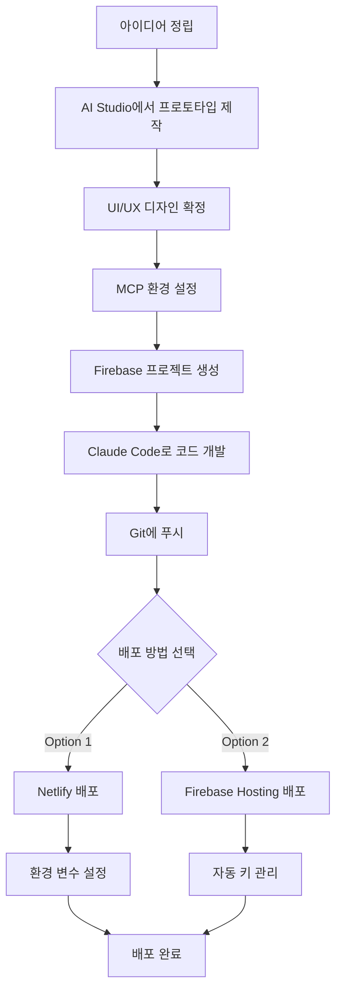
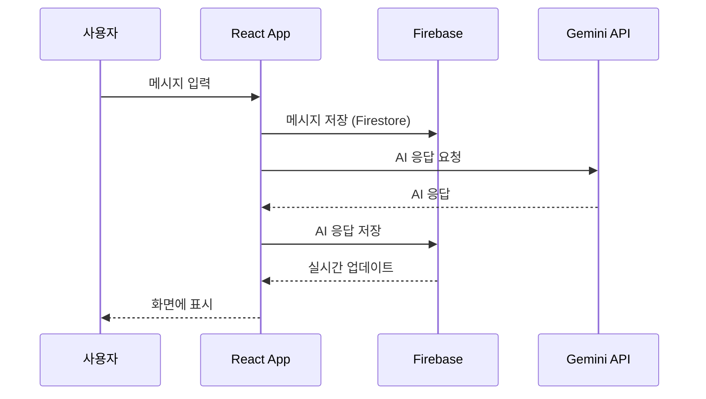

# 웹 앱 개발 종합 가이드

> Claude Code, AI Studio, Antigravity, Firebase를 활용한 체계적 개발 프로세스

## 목차

- [[#개발 환경 개요|개발 환경 개요]]
- [[#개발 프로세스 전체 흐름|개발 프로세스 전체 흐름]]
- [[#1단계 - 프로토타입 설계 (AI Studio)|1단계 - 프로토타입 설계 (AI Studio)]]
- [[#2단계 - MCP 설정 및 환경 구성|2단계 - MCP 설정 및 환경 구성]]
- [[#3단계 - Firebase 데이터베이스 설정|3단계 - Firebase 데이터베이스 설정]]
- [[#4단계 - Claude Code 개발|4단계 - Claude Code 개발]]
- [[#5단계 - 배포 프로세스|5단계 - 배포 프로세스]]
- [[#문제 해결 가이드|문제 해결 가이드]]
- [[#핵심 개념 정리|핵심 개념 정리]]

---


## 주요 도구의 역할

#### AI Studio (Google)

- **목적**: 프로토타입 제작 및 UI/UX 설계
- **특징**:
    - 빠른 프론트엔드 프로토타입 생성
    - 실시간 UI 수정 기능 (Annotate App)
    - Gemini 2.5 모델 기반 챗봇 구현
    - 코드 편집 불가 (프로토타입 전용)
- **제한사항**: 백엔드 기능 없음, 데이터 저장 불가

#### Claude Code / Antigravity

- **목적**: 실제 프로덕션 코드 개발
- **특징**:
    - MCP(Model Context Protocol) 연동
    - 파일 시스템 직접 접근 및 수정
    - Git 연동 및 버전 관리
    - 백엔드 로직 구현 가능
- **차이점**:
    - Claude Code: 터미널 기반 개발 도구
    - Antigravity: 하이브리드 웹/로컬 개발 환경 (Warp의 업그레이드 버전)

#### Firebase

- **목적**: 백엔드 인프라 (NoSQL 데이터베이스, 인증, 호스팅)
- **선택 이유**:
    - Supabase 대비 무료 프로젝트 제한 없음
    - NoSQL 구조로 초기 개발 용이
    - 자동 데이터 관리 및 실시간 동기화
    - 인증(Authentication) 기능 내장
- **주요 기능**:
    - Firestore Database (NoSQL)
    - Firebase Authentication
    - Firebase Hosting

## SQL vs NoSQL 비교

#### SQL (Supabase 등)

```
이름: "홍길동" → 결과: "홍길동"
```

- 엑셀 스프레드시트와 유사한 구조
- 명확한 스키마 정의 필요
- 복잡한 쿼리 작성 가능

#### NoSQL (Firebase)

```
이름: "홍길동" → 결과: { ko: "홍길동", en: "Hong Gil-dong", ... }
```

- 유연한 데이터 구조
- 필드에 다양한 타입 저장 가능
- 초기 개발에 용이하나 복잡한 쿼리는 제한적

---

## 개발 프로세스 전체 흐름

#### 전체 워크플로우 다이어그램



### 단계별 체크리스트

#### Phase 1: 기획

- [ ] 앱의 핵심 기능 정의
- [ ] 필요한 데이터 구조 스케치
- [ ] 사용자 플로우 설계

#### Phase 2: 프로토타입

- [ ] AI Studio 접속 및 프롬프트 작성
- [ ] 기본 챗봇 기능 구현
- [ ] UI 디자인 Annotate로 수정
- [ ] 프로토타입 동작 검증

#### Phase 3: 환경 구성

- [ ] MCP 설치 (Firebase MCP)
- [ ] Firebase 프로젝트 생성
- [ ] API 키 발급
- [ ] 인증 설정

#### Phase 4: 개발

- [ ] Claude Code에서 프로젝트 초기화
- [ ] AI Studio 코드 참고하여 구현
- [ ] 백엔드 로직 추가
- [ ] 로컬 테스트

#### Phase 5: 배포

- [ ] Git 저장소 생성
- [ ] 환경 변수 분리
- [ ] 배포 플랫폼 선택
- [ ] 프로덕션 테스트

---

## 1단계 - 프로토타입 설계 (AI Studio)

### AI Studio 접속 및 기본 설정

#### 1.1 AI Studio 접속

```
URL: https://aistudio.google.com
```

1. Google 계정으로 로그인
2. **"Chat with model"** 메뉴 선택
3. 기본 채팅 인터페이스 확인

### 챗봇 앱 프로토타입 제작

#### 1.2 프로젝트 시작

**프롬프트 작성 예시**:

```
해외 여행을 추천해주는 챗봇을 만들어주세요.
```

**Build 버튼 클릭 후 대기** (1~5분 소요)

**생성 결과 확인**:

- 앱 이름 자동 생성 (예: Travel Genie, Wanderlust AI)
- 기본 채팅 UI 생성
- Gemini API 연동 완료

#### 1.3 기능 테스트

**테스트 시나리오**:

```
사용자 입력: "따뜻한 휴양지 추천해줘, 3박 4일, 가족, 예산 300만원"
```

**결과 확인 사항**:

- 응답 언어 (영어로 나올 경우 한국어 변경 필요)
- 응답 품질
- UI 레이아웃

#### 1.4 언어 설정

**영어로 응답이 나올 경우**:

```
프롬프트: "한국어 사용자를 위해서 한국어 언어팩을 추가해주세요"
```

결과: 언어 전환 버튼이 추가되거나, 기본 언어가 한국어로 변경됨

### UI 커스터마이징 (Annotate App)

#### 1.5 Annotate App 기능 활용

**접근 방법**:

1. **"Annotate App"** 버튼 클릭
2. Preview 화면으로 이동
3. 도구창 확인

**주요 도구**:

- **Arrow**: 요소 선택
- **Pencil**: 그리기
- **Add Command**: 영역 선택 후 수정 요청

#### 1.6 디자인 수정 실습

**예시: 채팅창 색상 변경**

1. **Add Command** 도구 선택
2. 채팅창 영역 드래그로 선택
3. 프롬프트 입력:

```
채팅창 디자인을 따뜻하게 바꿔줘
```

4. **"Add to Chat"** 버튼 클릭
5. 스크린샷이 자동으로 캡처되어 프롬프트에 첨부됨
6. **"Send Prompt"** 클릭
7. AI가 디자인을 수정하고 반영

**수정 가능한 요소**:

- 색상 스키마
- 레이아웃 배치
- 버튼 스타일
- 폰트 크기 및 종류
- 간격 및 여백

#### 1.7 프롬프트 수정

**코드 에디터 접근**:

1. **"Code"** 또는 **"Show Code Editor"** 클릭
2. 파일 트리 확인

**주요 파일 구조**:

```
├── src/
│   ├── components/
│   │   ├── ChatInput.tsx       # 채팅 입력 컴포넌트
│   │   ├── ChatMessage.tsx     # 메시지 표시 컴포넌트
│   │   └── ...
│   ├── services/
│   │   └── geminiService.ts    # Gemini API 호출 로직
│   └── App.tsx                 # 메인 앱 컴포넌트
```

**프롬프트 위치 찾기**:

- `geminiService.ts` 파일 열기
- 시스템 프롬프트 섹션 찾기

**프롬프트 수정 예시**:

```typescript
// 수정 전
const systemPrompt = "You are a helpful travel guide for international destinations.";

// 수정 후
const systemPrompt = "당신은 일본 여행 전문 가이드입니다. 일본의 다양한 지역 정보를 상세히 제공합니다.";
```

**저장 및 확인**:

1. 파일 저장 (자동 저장)
2. Preview로 돌아가기
3. 새로고침 (F5)
4. 테스트 질문 입력하여 변경사항 확인

### 코드 구조 이해

#### 1.8 React 컴포넌트 구조

**컴포넌트란?**:

- 레고 블록처럼 조립 가능한 기능 단위
- 각 컴포넌트는 독립적인 파일로 존재
- 재사용 가능한 UI 요소

**App.tsx 구조 예시**:

```tsx
import ChatInput from './components/ChatInput';
import ChatMessage from './components/ChatMessage';
import { geminiService } from './services/geminiService';

function App() {
  return (
    <div className="app-container">
      <ChatMessage />  {/* 레고 블록 1 */}
      <ChatInput />    {/* 레고 블록 2 */}
    </div>
  );
}
```

#### 1.9 HTML 생성 구조

**React의 JSX**:

- JavaScript 안에서 HTML 작성 가능
- `return` 문 이후 HTML 코드 생성

**예시**:

```tsx
function ChatMessage({ message }) {
  return (
    <div className="message">
      <p>{message.text}</p>
      <span>{message.timestamp}</span>
    </div>
  );
}
```

이 코드는 다음 HTML을 생성:

```html
<div class="message">
  <p>안녕하세요</p>
  <span>14:30</span>
</div>
```

### 프로토타입 완성 체크리스트

- [ ] 기본 채팅 기능 동작 확인
- [ ] 언어 설정 완료
- [ ] UI 디자인 만족도 확인
- [ ] 프롬프트 내용 최종 조정
- [ ] 코드 구조 기본 이해

**다음 단계**: 이 프로토타입을 기반으로 실제 프로덕션 코드를 Claude Code에서 구현

---

## 2단계 - MCP 설정 및 환경 구성

### MCP(Model Context Protocol) 개요

#### 2.1 MCP란?

**정의**:

- AI 도구가 외부 서비스(데이터베이스, API 등)와 통신하기 위한 프로토콜
- Claude Code가 Firebase, Google Drive 등에 접근하는 통로

**작동 원리**:

```
Claude Code → MCP → Firebase
           ↓
     명령어 전달 및 데이터 수신
```

**MCP가 없으면**:

- AI가 수동으로 작성된 코드만 생성
- 데이터베이스 연결 수동 설정 필요
- 오류 발생 시 직접 디버깅

**MCP가 있으면**:

- AI가 직접 데이터베이스 쿼리 실행
- 자동 설정 및 오류 수정
- 실시간 데이터 확인 가능

#### 2.2 왜 수동 설치가 어려운가?

**JSON 설정 파일의 복잡성**:

```json
{
  "mcpServers": {
    "firebase": {
      "command": "npx",
      "args": ["-y", "@firebase/mcp-server"],
      "env": {
        "FIREBASE_PROJECT_ID": "your-project-id"
      }
    }
  }
}
```


**해결책**: MCP 설치 자동화 프롬프트 사용

### MCP 설치 프로세스

#### 2.3 Firebase MCP 설치

**준비물**:

- Claude Code 또는 Antigravity 실행
- 인터넷 연결

**설치 단계**:

**Step 1: MCP Registry 접속**

```
URL: https://github.com/modelcontextprotocol/servers
```

**Step 2: Firebase MCP 찾기**

- 검색: "Firebase MCP"
- 저장소 URL 복사

**Step 3: Claude Code에서 설치**

**프롬프트**:

```
다음 주소의 MCP를 설치해줘:
[복사한 Firebase MCP URL]
```

**또는 직접 프롬프트**:

```
Firebase MCP를 설치해줘. 
npm을 통해 @firebase/mcp-server를 설치하고 설정 파일에 추가해줘.
```

**Step 4: 설치 확인**

Claude Code가 다음 작업 수행:

1. npm 패키지 설치
2. 설정 파일 자동 수정
3. 재시작 프롬프트 표시

**재시작 방법**:

- Claude Code 재시작
- 또는 터미널에서 `reload` 명령어

#### 2.4 전역 MCP 설치 (선택사항)

**전역 설치란?**:

- 모든 프로젝트에서 사용 가능한 MCP
- 한 번만 설치하면 지속적으로 사용

**설정 방법**:

```
프롬프트: "Firebase MCP를 --scope-user 옵션으로 전역 설치해줘"
```

**결과**:

- 새 프로젝트마다 재설치 불필요
- 설정 파일 공유 가능

#### 2.5 MCP 연결 확인

**확인 프롬프트**:

```
Firebase MCP가 제대로 연결되었는지 확인해줘
```

**정상 연결 시 응답**:

```
✓ Firebase MCP 연결됨
✓ 사용 가능한 명령어: 
  - createProject
  - getFirestore
  - setDocument
  - getDocument
  ...
```

**오류 발생 시**:

1. Claude Code 재시작
2. npm 캐시 클리어: `npm cache clean --force`
3. 수동 설정 파일 확인

### 환경 변수 및 API 키 관리

#### 2.6 API 키 발급

**Google AI Studio API 키**:

**발급 절차**:

1. AI Studio 접속
2. 좌측 메뉴 **"Get API Key"** 클릭
3. **"Create API Key"** 버튼
4. 키 복사 (한 번만 표시됨!)

**주의사항**:

- 키는 즉시 안전한 곳에 저장
- 재발급 시 이전 키는 무효화됨

#### 2.7 환경 변수 설정

**로컬 개발 환경**:

`.env` 파일 생성:

```env
VITE_GEMINI_API_KEY=your_api_key_here
VITE_FIREBASE_API_KEY=your_firebase_api_key
VITE_FIREBASE_PROJECT_ID=your_project_id
```

**주의**:

- `.env` 파일은 `.gitignore`에 반드시 추가
- `VITE_` 접두사는 Vite 프레임워크용 (다른 프레임워크는 다를 수 있음)

**코드에서 사용**:

```typescript
const apiKey = import.meta.env.VITE_GEMINI_API_KEY;
```

#### 2.8 문서 버전 관리의 중요성

**왜 최신 문서가 중요한가?**

**사례 - OpenAI API 버전 변경**:

```python
# 구버전 (0.1 이전)
response = openai.Completion.create(...)

# 신버전 (1.0 이후)
response = client.chat.completions.create(...)
```

**AI가 구버전 코드를 제공하는 이유**:

- 학습 데이터가 과거 버전 기반
- 최신 업데이트가 반영되지 않음

**해결 방법**:

```
프롬프트: "다음 공식 문서를 참고해서 코드를 작성해줘: [공식 문서 URL]"
```

**공식 문서 제공 예시**:

```
Firebase의 최신 문서(https://firebase.google.com/docs/firestore/quickstart)를 
바탕으로 Firestore 연결 코드를 작성해줘.
```

### MCP 설정 완료 체크리스트

- [ ] Firebase MCP 설치 완료
- [ ] MCP 연결 확인
- [ ] API 키 발급 완료
- [ ] .env 파일 생성
- [ ] .gitignore에 .env 추가
- [ ] 공식 문서 URL 준비

---

## 3단계 - Firebase 데이터베이스 설정

### Firebase 프로젝트 생성

#### 3.1 Firebase Console 접속

```
URL: https://console.firebase.google.com
```

**프로젝트 생성 절차**:

1. **"프로젝트 추가"** 클릭
2. 프로젝트 이름 입력 (예: `travel-chatbot`)
3. Google Analytics 설정 (선택사항, 일단 비활성화 가능)
4. 프로젝트 생성 완료 대기 (1~2분)

#### 3.2 Firestore Database 생성

**데이터베이스 생성**:

1. 좌측 메뉴 **"Firestore Database"** 선택
2. **"데이터베이스 만들기"** 클릭
3. 위치 선택: **asia-northeast3** (서울) 권장
4. 보안 규칙 선택:
    - **테스트 모드**: 개발 초기 (30일 제한)
    - **프로덕션 모드**: 이후 수동 규칙 설정

**테스트 모드 규칙**:

```javascript
rules_version = '2';
service cloud.firestore {
  match /databases/{database}/documents {
    match /{document=**} {
      allow read, write: if request.time < timestamp.date(2025, 12, 31);
    }
  }
}
```

**주의**: 테스트 모드는 누구나 읽기/쓰기 가능하므로 개발용으로만 사용

### 컬렉션 및 문서 구조 설계

#### 3.3 Firestore 데이터 구조

**NoSQL 구조 이해**:

```
Collection (컬렉션)
└── Document (문서)
    └── Fields (필드)
        └── Sub-Collection (하위 컬렉션)
```

**채팅 앱 예시 구조**:

```
chats (컬렉션)
├── chat_001 (문서)
│   ├── userId: "user123"
│   ├── messages (하위 컬렉션)
│   │   ├── msg_001
│   │   │   ├── text: "안녕하세요"
│   │   │   ├── timestamp: 2025-11-29T10:00:00
│   │   │   └── role: "user"
│   │   └── msg_002
│   │       ├── text: "안녕하세요! 무엇을 도와드릴까요?"
│   │       ├── timestamp: 2025-11-29T10:00:05
│   │       └── role: "assistant"
│   └── createdAt: 2025-11-29T10:00:00
```

#### 3.4 컬렉션 생성

**수동 생성 (Firebase Console)**:

1. **"컬렉션 시작"** 클릭
2. 컬렉션 ID: `chats`
3. 첫 문서 ID: 자동 생성 또는 직접 입력
4. 필드 추가:
    - `userId` (string)
    - `createdAt` (timestamp)

**MCP를 통한 자동 생성**:

```
프롬프트: "Firestore에 'chats' 컬렉션을 생성하고, 
첫 번째 문서에 userId와 createdAt 필드를 추가해줘"
```

Claude Code가 자동으로:

1. 컬렉션 생성
2. 문서 추가
3. 필드 설정

### Firebase Authentication 설정

#### 3.5 인증 방식 선택

**Firebase Authentication 활성화**:

1. 좌측 메뉴 **"Authentication"** 선택
2. **"시작하기"** 클릭

**이메일/비밀번호 인증 설정**:

1. **"Sign-in method"** 탭
2. **"이메일/비밀번호"** 선택
3. **활성화** 토글 켜기
4. 저장

**Google 로그인 설정 (선택)**:

1. **"Google"** 제공업체 선택
2. **활성화** 토글
3. 프로젝트 공개 이름 입력
4. 지원 이메일 선택
5. 저장

#### 3.6 인증 규칙 설정

**Firestore 보안 규칙 업데이트**:

테스트 모드에서 인증 기반 규칙으로 변경:

```javascript
rules_version = '2';
service cloud.firestore {
  match /databases/{database}/documents {
    // 채팅 데이터는 본인만 접근 가능
    match /chats/{chatId} {
      allow read, write: if request.auth != null 
                         && request.auth.uid == resource.data.userId;
    }
    
    // 메시지는 해당 채팅 소유자만 접근
    match /chats/{chatId}/messages/{messageId} {
      allow read, write: if request.auth != null 
                         && get(/databases/$(database)/documents/chats/$(chatId)).data.userId == request.auth.uid;
    }
  }
}
```

**규칙 설명**:

- `request.auth != null`: 로그인한 사용자만
- `request.auth.uid == resource.data.userId`: 문서의 userId가 현재 사용자 ID와 일치할 때만

#### 3.7 Firebase 프로젝트 설정 정보 가져오기

**웹 앱에 Firebase 추가**:

1. Firebase Console 프로젝트 설정 (톱니바퀴 아이콘)
2. **"내 앱"** 섹션에서 **웹(</> 아이콘)** 클릭
3. 앱 닉네임 입력
4. **Firebase Hosting 설정** 체크 (선택)
5. **앱 등록** 클릭

**Firebase 구성 객체 복사**:

```javascript
const firebaseConfig = {
  apiKey: "AIzaSy...",
  authDomain: "your-project.firebaseapp.com",
  projectId: "your-project",
  storageBucket: "your-project.appspot.com",
  messagingSenderId: "123456789",
  appId: "1:123456789:web:abcdef"
};
```

**환경 변수로 저장**:

```env
VITE_FIREBASE_API_KEY=AIzaSy...
VITE_FIREBASE_AUTH_DOMAIN=your-project.firebaseapp.com
VITE_FIREBASE_PROJECT_ID=your-project
VITE_FIREBASE_STORAGE_BUCKET=your-project.appspot.com
VITE_FIREBASE_MESSAGING_SENDER_ID=123456789
VITE_FIREBASE_APP_ID=1:123456789:web:abcdef
```

### Firebase 설정 완료 체크리스트

- [ ] Firebase 프로젝트 생성
- [ ] Firestore Database 활성화
- [ ] 컬렉션 구조 설계
- [ ] Authentication 설정 (이메일/비밀번호)
- [ ] 보안 규칙 작성
- [ ] Firebase 구성 정보 복사
- [ ] 환경 변수 파일 업데이트

---

## 4단계 - Claude Code 개발

### 프로젝트 초기화

#### 4.1 Claude Code 시작

**프로젝트 생성 프롬프트**:

```
React와 TypeScript를 사용하는 채팅 앱을 만들어줘.
Vite를 빌드 도구로 사용하고, Firebase Firestore와 Authentication을 연동해줘.
```

**Claude Code 작업 순서**:

1. Vite React TypeScript 템플릿 생성
2. 필요한 npm 패키지 설치
3. 폴더 구조 생성
4. 기본 컴포넌트 파일 생성

**생성되는 폴더 구조**:

```
project-root/
├── src/
│   ├── components/
│   ├── services/
│   ├── hooks/
│   ├── types/
│   ├── App.tsx
│   └── main.tsx
├── public/
├── .env
├── .gitignore
├── package.json
├── tsconfig.json
└── vite.config.ts
```

#### 4.2 Firebase 연동 코드

**Firebase 초기화 파일 생성**:

`src/services/firebase.ts`:

```typescript
import { initializeApp } from 'firebase/app';
import { getFirestore } from 'firebase/firestore';
import { getAuth } from 'firebase/auth';

const firebaseConfig = {
  apiKey: import.meta.env.VITE_FIREBASE_API_KEY,
  authDomain: import.meta.env.VITE_FIREBASE_AUTH_DOMAIN,
  projectId: import.meta.env.VITE_FIREBASE_PROJECT_ID,
  storageBucket: import.meta.env.VITE_FIREBASE_STORAGE_BUCKET,
  messagingSenderId: import.meta.env.VITE_FIREBASE_MESSAGING_SENDER_ID,
  appId: import.meta.env.VITE_FIREBASE_APP_ID
};

// Firebase 초기화
const app = initializeApp(firebaseConfig);

// Firestore 및 Auth 인스턴스
export const db = getFirestore(app);
export const auth = getAuth(app);
```

**Claude Code에 요청**:

```
Firebase 초기화 코드를 src/services/firebase.ts 파일에 작성해줘.
환경 변수는 .env 파일에서 가져오도록 설정해줘.
```

### AI Studio 프로토타입 코드 활용

#### 4.3 컴포넌트 구조 참고

**AI Studio에서 생성된 코드 분석**:

1. AI Studio 프로젝트에서 **"Show Code"** 클릭
2. 주요 컴포넌트 파일 확인:
    - `ChatMessage.tsx`
    - `ChatInput.tsx`
    - `geminiService.ts`

**코드 재사용 전략**:

```
프롬프트: "AI Studio에서 생성한 ChatMessage 컴포넌트를 참고해서 
Firebase와 연동되는 버전으로 다시 작성해줘."
```

**차이점**:

- AI Studio: 메모리 기반 (새로고침 시 데이터 사라짐)
- Claude Code: Firestore 연동 (영구 저장)


### 개발 완료 체크리스트

- [ ] 프로젝트 초기화
- [ ] Firebase 연동 완료
- [ ] 인증 기능 구현
- [ ] Firestore CRUD 구현
- [ ] Gemini API 연동
- [ ] 로컬 테스트 통과
- [ ] 주요 기능 동작 확인


## 5단계 - 배포 프로세스

### Git 저장소 설정

#### 5.1 Git 초기화

**Git 초기 설정**:

```bash
git init
git add .
git commit -m "Initial commit"
```

**Claude Code로 자동화**:

```
프롬프트: "Git 저장소를 초기화하고 첫 커밋을 만들어줘"
```

#### 5.2 GitHub 저장소 연결

**GitHub 저장소 생성**:

1. GitHub 웹사이트 접속
2. **"New repository"** 클릭
3. 저장소 이름 입력
4. **Public** 또는 **Private** 선택
5. **Create repository**

**로컬과 연결**:

```bash
git remote add origin https://github.com/username/repository-name.git
git branch -M main
git push -u origin main
```

**Claude Code 프롬프트**:

```
GitHub 저장소 [URL]과 연결하고 코드를 푸시해줘
```

#### 5.3 .gitignore 설정

**필수 제외 항목**:

```
# .gitignore
node_modules/
dist/
.env
.env.local
.env.production

# 운영체제
.DS_Store
Thumbs.db

# IDE
.vscode/
.idea/

# 로그
*.log
npm-debug.log*
```

**확인 사항**:

- `.env` 파일이 Git에 포함되지 않았는지 확인
- GitHub에 API 키가 노출되지 않았는지 점검

### Netlify 배포

#### 5.4 Netlify 배포 준비

**환경 변수 분리**:

**문제점**:

- `.env` 파일은 Git에 포함되지 않음
- Netlify는 환경 변수를 어떻게 알 수 있을까?

**해결책**: Netlify 대시보드에서 환경 변수 설정

#### 5.5 Netlify 배포 과정

**Step 1: Netlify 가입 및 로그인**

```
URL: https://www.netlify.com
```

**Step 2: 새 사이트 추가**

1. **"Add new site"** → **"Import an existing project"**
2. **"GitHub"** 선택 및 인증
3. 배포할 저장소 선택

**Step 3: 빌드 설정**

- **Build command**: `npm run build`
- **Publish directory**: `dist`

**Step 4: 환경 변수 설정**

1. **Site settings** → **Environment variables**
2. 각 환경 변수 추가:
    - Key: `VITE_GEMINI_API_KEY`
    - Value: `[실제 API 키]`
3. 모든 Firebase 관련 변수 추가

**Step 5: 배포 시작**

- **"Deploy site"** 클릭
- 빌드 로그 확인

#### 5.6 배포 오류 해결

**일반적인 오류**:

**오류 1: 환경 변수 인식 실패**

```
Error: import.meta.env.VITE_GEMINI_API_KEY is undefined
```

**해결**:

- Netlify 환경 변수에 변수명이 정확히 입력되었는지 확인
- 변수 추가 후 재배포 필요

**오류 2: Firebase 초기화 실패**

```
Error: Firebase: Error (auth/invalid-api-key)
```

**해결**:

- Firebase 구성 정보가 모두 올바른지 확인
- API 키 앞뒤 공백 제거

**Claude Code에 도움 요청**:

```
프롬프트: "Netlify 배포 중 다음 에러가 발생했어:
[에러 로그 복사]

빌드 설정이나 코드에서 수정할 부분이 있는지 확인해줘."
```

#### 5.7 .gitignore 외 보안 설정

**Option 1: .env 파일 스캔 방지**

`.gitignore`에 추가:

```
.env*
!.env.example
```

`.env.example` 파일 생성:

```
VITE_GEMINI_API_KEY=your_api_key_here
VITE_FIREBASE_API_KEY=your_firebase_key_here
```

**Option 2: GitHub Secrets 활용**

GitHub Actions를 사용하는 경우:

1. 저장소 **Settings** → **Secrets and variables** → **Actions**
2. **New repository secret** 추가
3. GitHub Actions 워크플로우에서 사용

### Firebase Hosting 배포 (대안)

#### 5.8 Firebase Hosting 개요

**장점**:

- Firebase 프로젝트와 통합
- 환경 변수 자동 관리
- CDN 자동 제공
- 무료 SSL 인증서

**단점**:

- Netlify보다 설정이 복잡
- CI/CD 파이프라인 직접 구성 필요

#### 5.9 Firebase Hosting 배포

**Step 1: Firebase CLI 설치**

```bash
npm install -g firebase-tools
```

**Step 2: Firebase 로그인**

```bash
firebase login
```

**Step 3: Firebase 초기화**

```bash
firebase init hosting
```

**설정 선택**:

- **Project**: 기존 Firebase 프로젝트 선택
- **Public directory**: `dist`
- **Single-page app**: `Yes`
- **GitHub integration**: 선택사항

**Step 4: 빌드 및 배포**

```bash
npm run build
firebase deploy --only hosting
```

**Claude Code로 자동화**:

```
프롬프트: "Firebase Hosting에 배포할 수 있도록 설정하고 배포해줘"
```

#### 5.10 Firebase Hosting 환경 변수

**Firebase Hosting의 환경 변수 처리**:

**빌드 시점 환경 변수**:

- `.env` 파일은 빌드 시 코드에 포함됨
- 배포 후 변경 불가

**권장 방법**:

1. 로컬에서 `.env` 파일로 빌드
2. 빌드된 `dist` 폴더만 배포
3. API 키는 이미 빌드된 코드에 포함되어 있음

**보안 강화**:

- Firebase Security Rules로 접근 제어
- Firestore 규칙에서 인증 확인
- API 키 노출은 클라이언트 앱에서 불가피

### 배포 후 테스트

#### 5.11 프로덕션 테스트

**테스트 체크리스트**:

- [ ] 배포된 URL 접속 확인
- [ ] 회원가입 기능 테스트
- [ ] 로그인 기능 테스트
- [ ] 메시지 전송 및 수신 확인
- [ ] Firestore 데이터 저장 확인
- [ ] 새로고침 후 데이터 유지 확인
- [ ] 모바일 브라우저에서 테스트


### 배포 완료 체크리스트

- [ ] Git 저장소 생성 및 푸시
- [ ] .gitignore 설정 확인
- [ ] 배포 플랫폼 선택 (Netlify 또는 Firebase Hosting)
- [ ] 환경 변수 설정
- [ ] 배포 성공
- [ ] 프로덕션 테스트 완료
- [ ] 성능 점수 확인

---

## 문제 해결 가이드

### 일반적인 오류 및 해결책

#### 문제 1: MCP 설치 실패

**증상**:

```
Error: MCP server not found
```

**원인**:

- npm 설치 오류
- 설정 파일 경로 문제
- 네트워크 연결 문제

**해결 방법**:

1. npm 캐시 클리어:

```bash
npm cache clean --force
```

2. 수동 설치:

```bash
npm install -g @firebase/mcp-server
```

3. Claude Code 재시작
    
4. 설정 파일 확인:
    

```
프롬프트: "MCP 설정 파일(claude_desktop_config.json)을 확인하고 
Firebase MCP가 제대로 설정되어 있는지 검증해줘"
```

#### 문제 2: Firebase 연결 오류

**증상**:

```
FirebaseError: Firebase: Error (auth/network-request-failed)
```

**원인**:

- 잘못된 Firebase 구성
- 네트워크 문제
- CORS 설정 문제

**해결 방법**:

**Step 1: Firebase 구성 확인**

```typescript
// firebase.ts에서 콘솔 로그 추가
console.log('Firebase Config:', {
  apiKey: import.meta.env.VITE_FIREBASE_API_KEY?.substring(0, 5) + '...',
  projectId: import.meta.env.VITE_FIREBASE_PROJECT_ID
});
```

**Step 2: 환경 변수 확인**

```
프롬프트: ".env 파일의 모든 Firebase 관련 변수가 올바르게 설정되었는지 확인해줘"
```

**Step 3: Firebase Console에서 도메인 승인**

1. Firebase Console → Authentication
2. **Settings** → **Authorized domains**
3. 배포 도메인 추가 (예: `your-app.netlify.app`)

#### 문제 3: Gemini API 응답 없음

**증상**:

- 메시지 전송 후 무한 로딩
- 에러 메시지 없음

**원인**:

- API 키 오류
- 요청 형식 문제
- API 할당량 초과

**해결 방법**:

**Step 1: API 키 확인**

```
프롬프트: "Gemini API 호출이 실패하는지 확인하고, 
API 키가 올바른지 테스트하는 코드를 추가해줘"
```

**Step 2: 에러 핸들링 강화**

```typescript
try {
  const response = await sendMessageToGemini(message, history);
  return response;
} catch (error) {
  console.error('Gemini API Error:', error);
  if (error instanceof Error) {
    alert(`오류 발생: ${error.message}`);
  }
  throw error;
}
```

**Step 3: API 할당량 확인**

- Google AI Studio → **API Keys** → **Usage**
- 무료 할당량: 분당 60 요청

#### 문제 4: 빌드 오류

**증상**:

```
Error: Cannot find module '@google/generative-ai'
```

**원인**:

- 패키지 설치 누락
- package.json 불일치

**해결 방법**:

**Step 1: 패키지 재설치**

```bash
rm -rf node_modules
npm install
```

**Step 2: 패키지 버전 확인**

```json
{
  "dependencies": {
    "firebase": "^10.7.0",
    "@google/generative-ai": "^0.1.3",
    "react": "^18.2.0"
  }
}
```

**Step 3: Claude Code에 요청**

```
프롬프트: "빌드 오류가 발생했어. package.json과 실제 설치된 패키지를 확인하고 
누락된 패키지가 있으면 설치해줘"
```

#### 문제 5: 배포 후 환경 변수 인식 실패

**증상**:

- 로컬에서는 동작하지만 배포 후 API 호출 실패
- `undefined` 에러

**원인**:

- Netlify/Vercel 환경 변수 미설정
- 빌드 시점과 런타임 환경 변수 혼동

**해결 방법**:

**Step 1: 배포 플랫폼 환경 변수 확인**

- Netlify: Site settings → Environment variables
- 모든 `VITE_*` 변수가 설정되었는지 확인

**Step 2: 빌드 로그 확인**

```
프롬프트: "배포 빌드 로그를 확인해서 환경 변수가 제대로 로드되었는지 확인해줘"
```

**Step 3: 하드코딩 테스트 (임시)**

```typescript
// 테스트용 - 실제 배포에서는 제거
const apiKey = import.meta.env.VITE_GEMINI_API_KEY || 'TEST_KEY_HERE';
console.log('API Key loaded:', apiKey ? 'Yes' : 'No');
```

### 문서 버전 불일치 문제

#### 문제 6: AI가 구버전 코드 제공

**증상**:

- Firebase v8 문법 사용 (현재 v10)
- 작동하지 않는 API 호출

**해결 방법**:

**공식 문서 제공 프롬프트**:

```
다음 공식 문서를 참고해서 코드를 작성해줘:
https://firebase.google.com/docs/firestore/quickstart

특히 v10 모듈 문법을 사용해줘.
```

**올바른 v10 문법**:

```typescript
// ❌ 구버전 (v8)
firebase.firestore().collection('chats').add({...})

// ✅ 신버전 (v10)
import { collection, addDoc } from 'firebase/firestore';
import { db } from './firebase';

await addDoc(collection(db, 'chats'), {...})
```

### 디버깅 프로세스

#### 체계적 디버깅 단계

**1. 문제 재현**

- 어떤 상황에서 오류가 발생하는지 파악
- 재현 가능한 단계 정리

**2. 에러 메시지 수집**

- F12 → Console 탭 확인
- Network 탭에서 실패한 요청 확인
- 서버 로그 확인 (Firebase Console)

**3. Claude Code에 상세 정보 제공**

```
프롬프트: "다음 상황에서 오류가 발생했어:
1. 사용자가 로그인 버튼 클릭
2. 이메일/비밀번호 입력
3. 제출 시 다음 에러 발생:

[에러 메시지]

브라우저 콘솔에는 다음이 표시돼:
[콘솔 로그]

Network 탭에서는 다음 요청이 실패했어:
[요청 상세]

원인을 분석하고 해결 방법을 제시해줘."
```

**4. 단계별 테스트**

- 문제를 작은 단위로 분리
- 각 단계별로 동작 확인

**5. 해결 및 검증**

- 수정 사항 적용
- 전체 플로우 재테스트

---

## 핵심 개념 정리

### 플랫폼별 역할 요약

|도구|역할|장점|한계|
|---|---|---|---|
|**AI Studio**|프로토타입 제작|빠른 UI/UX 검증, 비주얼 편집|백엔드 없음, 코드 수정 제한|
|**Claude Code**|프로덕션 개발|완전한 개발 환경, MCP 연동|터미널 기반, 초기 설정 복잡|
|**Antigravity**|하이브리드 개발|웹+로컬 통합, 직관적 UI|최신 도구로 문서 부족 가능|
|**Firebase**|백엔드 인프라|NoSQL 유연성, 인증 내장|SQL 쿼리 제한적|
|**Netlify**|배포 플랫폼|Git 연동 자동 배포|환경 변수 수동 설정|
|**Firebase Hosting**|배포 플랫폼|Firebase 통합, 자동 키 관리|설정 복잡|

### 개발 워크플로우 Best Practices

#### 1. 프로토타입 우선 접근

```
AI Studio에서 UI 확정 → Claude Code에서 구현
```

- 빠른 반복 개발
- 요구사항 명확화

#### 2. 환경 변수 관리

```
.env (로컬) → .env.example (Git) → 플랫폼 환경변수 (배포)
```

- 절대 `.env`를 Git에 포함하지 않기
- `.env.example`로 필요한 변수 문서화

#### 3. 점진적 기능 추가

```
기본 채팅 → 인증 → 데이터 저장 → 배포
```

- 한 번에 하나의 기능만 구현
- 각 단계마다 테스트

#### 4. AI 협업 패턴

```
명확한 요구사항 → AI 코드 생성 → 검토 → 수정 요청 → 테스트
```

- 구체적인 프롬프트 작성
- 생성된 코드 이해하기
- 동작 확인 후 다음 단계

### 기술 스택 설명

#### Frontend

- **React**: UI 컴포넌트 라이브러리
- **TypeScript**: 타입 안정성
- **Vite**: 빠른 빌드 도구

#### Backend

- **Firebase Firestore**: NoSQL 데이터베이스
- **Firebase Auth**: 사용자 인증
- **Gemini API**: AI 채팅 기능

#### Development

- **Claude Code**: AI 기반 코딩 도구
- **MCP**: 외부 서비스 연동 프로토콜
- **Git**: 버전 관리

#### Deployment

- **Netlify** 또는 **Firebase Hosting**: 정적 사이트 호스팅
- **GitHub**: 코드 저장소

### 데이터 흐름 이해



### 보안 고려사항

#### API 키 보호

1. **환경 변수 사용**: 코드에 직접 입력 금지
2. **.gitignore 설정**: `.env` 파일 제외
3. **Firebase Rules**: 서버 측에서 접근 제어

## 추가 리소스

### 공식 문서

- **Firebase**: https://firebase.google.com/docs
- **React**: https://react.dev
- **Vite**: https://vitejs.dev
- **Gemini API**: https://ai.google.dev/docs

### 유용한 도구

- **Postman**: API 테스트
- **Firebase Emulator**: 로컬 Firebase 개발
- **React Developer Tools**: Chrome 확장 프로그램

### 커뮤니티

- **Stack Overflow**: 기술 Q&A
- **GitHub Discussions**: 오픈소스 논의
- **Discord**: 실시간 커뮤니티 지원

---

## 맺음말

이 가이드는 AI 도구를 활용한 현대적 웹 앱 개발의 전체 프로세스를 다룹니다.

**핵심 원칙**:

1. **명확한 기획**: 무엇을 만들지 정확히 정의
2. **프로토타입 우선**: AI Studio로 빠르게 검증
3. **점진적 구현**: 한 번에 하나씩 기능 추가
4. **AI 협업**: Claude Code와 효과적으로 소통
5. **테스트 중심**: 각 단계마다 동작 확인

**다음 단계**:

- 추가 기능 구현 (이미지 업로드, 음성 입력 등)
- UI/UX 개선
- 성능 최적화
- 사용자 피드백 수집 및 반영
