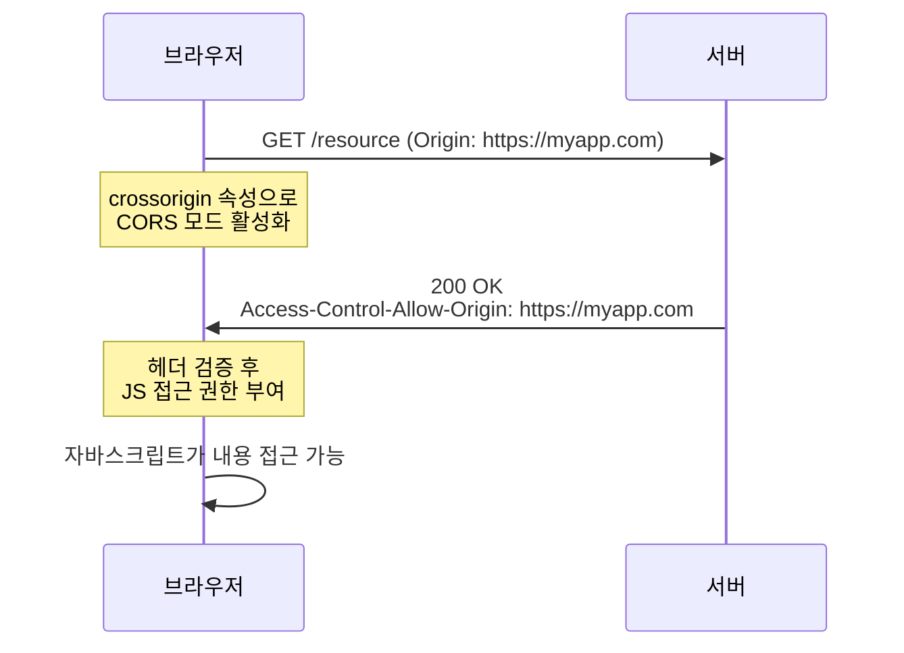

## crossorigin 속성과 CORS 메커니즘의 이해

> Vite 빌드 결과물에서 우연히 발견한 속성 하나에서 출발해, 웹 보안의 근본 원리까지 파고든 탐구

> [!quote] 핵심 메시지
> `crossorigin` 속성은 외부 서버에게 무언가를 부탁하는 것이 아니다. ==브라우저 자신에게 "이 리소스를 더 엄격한 검사 모드로 처리해 달라"고 지시하는 명령==이다.

Vite로 빌드된 `index.html`을 살펴보다가 낯선 속성 하나를 발견했다. `<script type="module" crossorigin src="...">`. 이 속성은 무엇이고, 왜 개발자가 직접 작성한 HTML에서는 거의 보이지 않을까? 이 작은 의문을 따라가다 보면, 결국 "왜 브라우저는 외부 리소스를 보여주는 것은 자유롭게 허용하면서 자바스크립트의 데이터 접근만 엄격히 통제하는가"라는 웹 보안의 근본 질문에 도달하게 된다.

---

## 1. crossorigin 속성이 처음 등장하는 자리

`crossorigin`은 HTML 태그(`<script>`, `<link>`, `` 등)에 붙는 속성으로, 브라우저가 해당 리소스를 가져올 때 **CORS(Cross-Origin Resource Sharing) 모드**로 요청을 처리하도록 지시한다. 값으로는 세 가지가 있다.

| 값 | 의미 | 사용 시점 |
|------|------|-----------|
| `anonymous` (또는 빈 값) | 인증 정보(쿠키 등)를 포함하지 않고 요청 | 가장 일반적 |
| `use-credentials` | 인증 정보를 포함하여 요청 | 보호된 리소스 접근 시 |
| 속성 생략 | CORS 모드 사용하지 않음 | 단순 사용 시 기본값 |

> [!info] 출처(Origin)란
> 웹에서 출처는 `프로토콜 + 도메인 + 포트`의 조합으로 정의된다. `https://example.com`과 `https://api.example.com`은 도메인이 달라 서로 다른 출처다. 브라우저의 **동일 출처 정책(Same-Origin Policy)**은 한 출처의 스크립트가 다른 출처의 리소스에 자유롭게 접근하는 것을 기본적으로 차단한다.

그런데 여기서 의문이 생긴다. 외부 리소스를 가져온다는 행위는 항상 동일해 보이는데, 왜 어떤 경우에는 이 속성이 필요하고 어떤 경우에는 필요 없을까?

---

## 2. 단순 사용과 데이터 접근의 결정적 차이

핵심은 외부 리소스에 대한 두 가지 행위를 명확히 구분하는 것이다.

> [!important] 두 차원의 구분
> **표현(Rendering)**: 이미지를 화면에 보여주거나, 스크립트를 실행하거나, CSS를 적용하는 것 → 일반적으로 ==CORS 없이도 자유롭게 허용==된다.
> **자바스크립트의 내용 접근**: 픽셀 데이터 추출, 오류 스택 트레이스 읽기, CSS 규칙 분석 등 → ==기본적으로 차단==되며, CORS 허가가 있어야만 풀린다.

같은 외부 이미지를 두 가지 방식으로 다루는 코드를 비교하면 이 차이가 분명해진다.

```html
<!-- 단순 사용: crossorigin 불필요 -->


<!-- 자바스크립트로 픽셀 데이터 접근: crossorigin 필요 -->

<script>
  const ctx = canvas.getContext('2d');
  ctx.drawImage(img, 0, 0);
  const pixels = ctx.getImageData(0, 0, img.width, img.height); // 여기서 막힘
</script>
```

첫 번째 코드는 이미지를 화면에 정상적으로 표시한다. 자바스크립트가 이 요소를 선택해 스타일을 바꾸거나 이벤트를 붙이는 것도 자유롭다. 하지만 두 번째 코드처럼 픽셀 데이터를 직접 읽으려는 시도는 `crossorigin` 속성과 서버의 CORS 허가가 모두 갖춰져야만 가능하다.

그렇다면 왜 이런 비대칭이 존재할까?

---

## 3. 왜 자바스크립트의 데이터 접근만 위험한가

이 질문의 답은 브라우저의 독특한 위치를 이해하는 데서 출발한다. 브라우저는 사용자가 방문하는 모든 사이트의 자격 증명(쿠키, 로그인 세션)을 들고 다니며, 사용자를 대신해 자동으로 요청을 보낸다. 만약 사용자가 은행 사이트에 로그인한 상태에서 악성 사이트를 방문하면, 그 악성 사이트가 은행 도메인으로 보내는 요청에도 사용자의 쿠키가 함께 실려간다.

이 상황에서 두 가지 위험 시나리오의 차이가 결정적이다.

> [!failure] 화면 표시만 가능한 경우
> 악성 사이트가 ``로 잔액 이미지를 가져온다 해도, 그 이미지는 사용자의 화면에만 표시된다. 사용자는 이를 보고 즉시 이상함을 알아채고 페이지를 닫는다. 정보가 흘러갈 다음 목적지가 없다.

> [!success] 자바스크립트 접근까지 가능한 경우 (가상)
> 같은 이미지를 자바스크립트가 캔버스에 그린 후 픽셀 데이터를 추출하고, OCR로 잔액을 읽어내고, 그 결과를 공격자 서버로 전송한다. 1초 안에 완료되며 화면에는 어떤 흔적도 남지 않는다. 사용자는 유출 사실을 영영 알 수 없다.

이 두 시나리오를 가르는 본질적인 차이는 네 가지로 정리할 수 있다.

| 측면 | 화면 표시 | 자바스크립트 접근 |
|------|-----------|------------------|
| **정보의 흐름** | 사용자 눈에서 멈춤 (막다른 골목) | 변수가 되어 어디로든 전송 가능 |
| **사용자 인지** | 직접 보고 판단 가능 (투명) | 백그라운드에서 발생 (불투명) |
| **자동화 규모** | 한 번에 한 사용자, 손으로 베끼기 | 수만 명에게서 자동·정확하게 수집 |
| **데이터 정밀도** | 사람 눈의 한계 (흐릿함) | 픽셀 단위 완벽 추출 (OCR 가능) |

> [!important] 핵심 통찰
> 자바스크립트는 ==데이터를 자동으로, 정확하게, 사용자 모르게, 대규모로, 다른 곳으로 전송할 수 있는 유일한 통로==다. 그래서 가장 강력한 도구에 가장 엄격한 안전장치가 붙는 것이다.

만약 모든 외부 리소스 표시까지 차단했다면 웹 자체가 작동을 멈춘다. 다른 출처의 라이브러리, 폰트, 이미지, 동영상을 조합해 만드는 것이 웹의 본질이기 때문이다. 브라우저는 그래서 균형점을 택했다. 표현은 자유롭게 허용하고, 데이터 추출은 명시적 허가가 있을 때만 풀어주는 것이다.

---

## 4. CORS 메커니즘이 실제로 동작하는 방식

이제 `crossorigin`이 어떻게 작동하는지 단계별로 들여다볼 수 있다. CORS는 다음과 같은 3단계 협상 절차다.



**1단계**: 브라우저가 요청에 `Origin` 헤더를 추가해 자신의 출처를 밝힌다.

**2단계**: 서버가 응답에 `Access-Control-Allow-Origin` 헤더로 허가 의사를 표시한다.

**3단계**: 브라우저가 헤더를 검증하고, 자바스크립트의 접근 권한을 부여하거나 차단한다.

> [!warning] 흔한 오해 바로잡기
> `crossorigin` 속성은 외부 서버에게 "데이터를 사용하게 해 주세요"라고 부탁하는 것이 ==아니다==. 서버는 이 속성의 존재 여부를 알지도 못하고 신경 쓰지도 않는다. 이 속성은 오직 브라우저에게 "CORS 검사 모드로 동작해 달라"고 지시하는 ==클라이언트 측 명령==일 뿐이다.

서버는 자신의 정해진 정책에 따라 응답을 내보낸다. 공개 CDN은 항상 `Access-Control-Allow-Origin: *`를 응답하고, 은행 서버는 절대로 그런 헤더를 응답하지 않는다. `crossorigin`을 붙이든 말든 서버의 행동은 동일하며, 변하는 것은 오직 브라우저가 그 응답을 어떻게 해석할지뿐이다.

---

## 5. crossorigin을 무분별하게 붙이면 안 되는 이유

이 협상 구조를 이해하면 한 가지 역설적인 사실이 드러난다. **`crossorigin`을 추가하는 순간, 더 엄격한 검사 모드가 활성화되어 검사를 통과하지 못한 리소스는 표현조차 차단된다.**

> [!failure] 잘 동작하던 코드가 깨지는 사례
> CORS 헤더를 응답하지 않는 서버의 이미지를 ``로 가져오면 정상 표시된다. 그런데 여기에 `crossorigin="anonymous"`를 추가하면, 브라우저는 CORS 검사를 시도하고 헤더가 없다는 것을 발견해 ==이미지 자체를 차단==한다.

따라서 `crossorigin`은 보험처럼 무조건 붙이는 것이 아니라, **명확한 목적이 있고 서버가 CORS를 지원할 때만** 추가해야 한다. 구체적으로는 다음과 같은 경우다.

| 사용 목적 | 필요한 이유 |
|-----------|------------|
| **Subresource Integrity (SRI)** | `integrity` 속성으로 무결성 검증 시 필수 |
| **캔버스 이미지 처리** | `getImageData()` 등으로 픽셀 접근 시 |
| **오류 추적 서비스** | 외부 스크립트의 상세 오류 정보 수집 |
| **ES Modules** | `<script type="module">`은 항상 CORS 모드 |
| **폰트 사전 로드** | `<link rel="preload" as="font">` 시 필수 |

이외의 일반적인 외부 리소스 사용에서는 `crossorigin` 없이 작성하는 것이 표준이며, 안전하다.

---

## 6. 그렇다면 왜 빌드 결과물에는 항상 보이는가

여기서 마지막 의문이 풀린다. 개발자가 직접 작성하는 HTML에서는 `crossorigin`을 거의 볼 수 없지만, Vite·Webpack·Next.js 같은 빌드 도구의 결과물에서는 거의 항상 발견된다. 이유는 두 가지다.

**첫째**, 빌드 도구는 ES Modules로 결과물을 생성한다. `<script type="module">`은 사양상 항상 CORS 모드로 동작하므로, 일관성을 위해 속성을 명시해 둔다.

**둘째**, 빌드 시점에는 결과물이 어떤 환경에 배포될지 알 수 없다. 같은 출처에서 서비스될 수도 있고, 별도의 CDN(Cloudflare, AWS CloudFront 등)에서 제공될 수도 있다. 미리 `crossorigin`을 붙여두면 배포 환경이 바뀌어도 HTML을 수정할 필요가 없다.

> [!tip] 실무적 판단 기준
> 사용자가 직접 HTML을 작성한다면, 외부 리소스에 `crossorigin`을 ==기본적으로 붙이지 않는다==. 위에서 언급한 특수 목적(SRI, 캔버스, 오류 추적, 폰트 preload)이 있을 때만 의식적으로 추가한다. 빌드 도구를 사용한다면 그 도구가 알아서 적절히 처리해주므로 신경 쓸 필요가 없다.

---

## 핵심 개념 정리

| 개념 | 의미 | 일상적 비유 |
|------|------|------------|
| **동일 출처 정책** | 다른 출처 리소스의 내용 접근을 기본적으로 차단 | 이웃집 일에 함부로 끼어들지 못하게 하는 규칙 |
| **CORS** | 서버가 명시적으로 공유를 허가하는 메커니즘 | 도서관 입구에 게시된 "촬영 허용" 안내문 |
| **Origin 헤더** | 요청 시 클라이언트가 자신의 출처를 밝히는 신원 표시 | 방문자가 입구에서 보여주는 신분증 |
| **Access-Control-Allow-Origin** | 서버가 응답에 포함하는 공유 허가 헤더 | 도서관이 발급하는 정식 출입증 |
| **crossorigin 속성** | 브라우저에게 CORS 검사 모드로 동작하라는 지시 | 사서에게 "촬영 허가까지 받아오라"고 시키는 명령 |
| **표현(Rendering)** | 리소스를 화면에 보여주거나 실행하는 것 | 책을 펼쳐 눈으로 읽기 |
| **데이터 접근** | 자바스크립트가 리소스의 내용을 분석하는 것 | 책을 카메라로 촬영해 분석하기 |

---

> [!abstract] 전체 흐름 요약
> `crossorigin` 속성은 작은 속성이지만 그 안에는 ==웹 보안의 핵심 철학==이 압축되어 있다. 브라우저는 사용자의 자격 증명을 들고 다니는 특수한 존재이기에, 외부 리소스의 내용이 자바스크립트로 자유롭게 흘러가면 어디든 유출될 수 있다. 그래서 표현은 자유롭게 허용하되 데이터 접근은 기본 차단하고, 서버가 명시적으로 허가한 경우에만 풀어주는 균형을 택했다. `crossorigin`은 이 협상 절차를 시작하는 클라이언트 측 스위치이며, 무분별하게 켜면 오히려 잘 동작하던 리소스가 차단되는 부작용이 있어 빌드 도구가 자동으로 처리하는 것이 보통이다.

---

## 관련 문서

