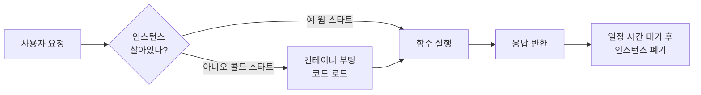

## 서버리스 함수의 정체와 API 키 보호 패턴

> 한 폴더 안에 섞여 있는 코드의 정체를 분리해서 보는 법 · 대상: 서버리스에 처음 입문하는 웹 개발자

> [!quote] 핵심 메시지
> 서버리스 함수란 결국 **"호출당 잠깐 떠서 한 가지 일을 처리하고 사라지는, 비밀을 아는 무상태 중개인"** 이다. 이 한 문장에서 작동 원리, 비용 모델, 그리고 비밀 키 보호의 모든 의의가 자연스럽게 흘러나온다.

Next.js나 Netlify로 처음 프로젝트를 만들면 한 폴더 안에 브라우저에서 도는 코드와 클라우드에서 도는 코드가 섞여 있다. 어디까지가 내 컴퓨터에서 실행되는 코드이고, 어디서부터가 클라우드에서 실행되는 코드인지 경계가 흐릿하게 느껴진다. 이 혼란은 결국 **"서버리스 함수가 무엇이며 어떻게 식별하는가"** 라는 하나의 질문으로 수렴한다. 이 질문을 따라가다 보면 자연스럽게 함수의 동작 원리와 보안적 가치가 드러난다.

---

## 1. 한 폴더 안의 코드는 어디서 실행되는가

현대 서버리스 웹 프레임워크에서 코드가 실행될 수 있는 장소는 결국 세 곳뿐이다. 사용자의 **브라우저(Client)**, 호출 시 깨어나는 **서버리스 함수(Serverless Function)**, 그리고 전 세계 CDN에 분산된 **엣지 함수(Edge Function)** 가 그것이다. 한 폴더 안에 모든 파일이 섞여 있는 듯 보이지만, 실제로는 각 파일이 자신이 실행될 환경을 작은 신호 — 파일 이름·위치·지시어 — 로 표시해 두고 있다.

| 환경 | 실행 위치 | 접근 가능한 것 | 비유 |
|------|-----------|----------------|------|
| Browser | 사용자 PC의 브라우저 | DOM, 브라우저 API, useState 등 | 손님의 손에 들린 메뉴판 |
| Serverless Function | 클라우드(AWS Lambda 등) | DB, 비밀 키, 외부 API | 주문 시 나타나는 푸드 트럭 |
| Edge Function | 전 세계 CDN 노드 | Web Standard API만 (제한적) | 동네마다 있는 셀프 키오스크 |

> [!info] 식별 규칙 한눈에
> Next.js App Router 기준으로, 파일 첫 줄에 `'use client'`가 있으면 **브라우저** 코드, `app/api/.../route.ts`이거나 함수에 `'use server'`가 붙어 있으면 **서버리스 함수**, `middleware.ts`이거나 `runtime: 'edge'`가 선언되어 있으면 **엣지 함수**, 셋 다 아니면 기본값인 **서버 컴포넌트**(서버리스 환경에서 HTML을 만들어내는 코드)이다.

식별 규칙까지 정리되었다면 이제 자연스럽게 다음 의문이 떠오른다. 서버리스 함수는 정확히 어떤 메커니즘으로 동작하는가?

---

## 2. 호출당 깨어나서 잠시 살다 사라지는 함수

서버리스(serverless)라는 이름은 다소 오해를 일으키기 쉽다. 서버가 없다는 뜻이 아니라, **개발자가 서버를 직접 관리할 필요가 없다** 는 뜻이다. 전통적인 Express.js 서버는 24시간 메모리에 상주하며 모든 요청을 받아내는 "한 곳에 머무르는 식당"에 가깝다면, 서버리스 함수는 **"주문이 들어올 때마다 즉석에서 푸드 트럭이 나타나 음식을 건네고 사라지는"** 모델에 가깝다.



이 작동 방식에서 자연스럽게 따라오는 특성이 몇 가지 있다. 평소에는 인스턴스가 떠 있지 않아 **호출당 과금**(실제 실행된 시간만큼만 청구) 이 가능하고, 트래픽이 폭증하면 클라우드가 알아서 동시 인스턴스를 수백·수천 개로 띄워주므로 **자동 확장**이 보장된다. 반면 함수 호출 사이에 **메모리 상태가 보존되지 않으므로**(stateless) 세션이나 캐시는 반드시 외부 저장소(DB, Redis, 쿠키)에 두어야 한다.

> [!warning] 콜드 스타트와 실행 시간 한도
> 한동안 호출이 없었다면 첫 요청 시 컨테이너 부팅에 100ms~1초의 추가 지연이 발생한다(콜드 스타트). 또한 함수당 실행 시간 한도가 있어(Vercel Hobby 10초, 유료 60~300초 수준) 영상 인코딩이나 머신러닝 학습 같은 장시간 작업에는 적합하지 않다.

여기까지 동작 원리는 이해했다. 그런데 한 가지 의문이 남는다. 클라우드는 도대체 어떻게 내 코드를 찾아서 실행하는 걸까?

---

## 3. 프레임워크가 코드를 찾는 약속, export`

JavaScript의 `export`는 "이 함수나 변수를 파일 바깥에서 가져다 쓸 수 있도록 공개하겠다"는 ES 모듈의 표준 키워드이다. 보통은 다른 파일에서 `import`로 가져다 쓰지만, **서버리스 환경에서는 가져다 쓰는 주체가 사람이 아니라 프레임워크 자신** 이라는 점이 다르다. 프레임워크는 빌드 시점에 정해진 위치의 파일들을 스캔하면서 약속된 이름으로 export된 함수들을 찾아내고, 그것을 자동으로 라우트 핸들러로 등록한다.

| 프레임워크 | 약속된 위치 | 약속된 export 이름 |
|------------|-------------|---------------------|
| Next.js App Router | `app/api/.../route.ts` | `GET`, `POST`, `PUT`, `DELETE`, `PATCH` (대문자 HTTP 메서드) |
| Next.js Pages Router | `pages/api/*.ts` | `default` export (단일 핸들러) |
| Netlify Functions | `netlify/functions/*.ts` | `handler` (단일 진입점) |

Next.js App Router는 특히 우아한데, 함수 이름 자체가 곧 HTTP 메서드 분기 역할을 한다. 사용자가 `/api/users`로 POST 요청을 보내면, 프레임워크는 내부적으로 `routeModule['POST']`로 같은 이름의 함수를 꺼내 호출한다. 의사 코드로 표현하면 다음과 같다.

```typescript
// Next.js 내부 로직 단순화
async function handleRequest(request) {
  const routeModule = await import(routeFileFor(request.url));
  const handler = routeModule[request.method];  // routeModule['POST']
  if (!handler) return new Response('Method Not Allowed', { status: 405 });
  return await handler(request);
}
```

이 구조 덕분에 정의되지 않은 메서드로 요청이 들어오면 자동으로 405가 반환되고, 새 메서드를 지원하려면 단순히 그 이름으로 함수를 하나 더 export하면 된다. 화려해 보이는 라우팅 시스템도 결국 **"문자열 키로 함수를 찾아 호출하는 객체 조회"** 라는 단순한 패턴 위에 세워져 있다.

이제 작동 원리가 모두 명확해졌다. 그런데 사실 더 본질적인 질문이 남아 있다 — 우리는 왜 굳이 서버리스 함수를 사이에 두는가? 브라우저에서 직접 외부 API를 호출하면 안 되는 이유는 무엇인가?

---

## 4. 서버리스 함수가 진정으로 가치 있는 이유 — 비밀 보호

OpenAI, Stripe, Gemini 같은 외부 서비스를 호출하려면 비밀 키(예: `sk-proj-aBc123...`)가 필요하다. 이 키는 곧 결제 정보·사용량 한도와 직결되는 일종의 비밀번호이며, 유출되면 누군가 내 계정으로 막대한 호출을 일으켜 청구서를 폭증시킬 수 있다.

> [!important] 절대 변하지 않는 두 가지 사실
> **첫째, 브라우저로 전송되는 모든 코드와 데이터는 완전히 공개된다.** 개발자 도구의 Sources·Network 탭에서 누구든 즉시 들여다볼 수 있다.
> **둘째, 서버리스 함수의 코드와 환경 변수는 클라우드에서만 읽히며 브라우저로는 절대 전송되지 않는다.**
> 이 두 사실의 결합이 서버리스 함수가 비밀 키 보호의 표준 패턴이 된 근본 이유이다.

> [!failure] Before — 클라이언트에서 직접 호출
> ```typescript
> 'use client';
> async function send(message) {
>   await fetch('https://api.openai.com/v1/chat/completions', {
>     headers: {
>       'Authorization': `Bearer ${process.env.NEXT_PUBLIC_OPENAI_KEY}`
>     },
>     // ...
>   });
> }
> ```
> 빌드 후 키 문자열이 클라이언트 번들에 그대로 박혀 모든 방문자에게 노출된다.

> [!success] After — 서버리스 함수를 중개인으로
> ```typescript
> // app/api/chat/route.ts (서버리스 함수)
> export async function POST(request: Request) {
>   const { message } = await request.json();
>   const apiKey = process.env.OPENAI_API_KEY;  // 클라우드에서만 조회
>   const res = await fetch('https://api.openai.com/v1/chat/completions', {
>     headers: { 'Authorization': `Bearer ${apiKey}` },
>     // ...
>   });
>   return Response.json(await res.json());
> }
> ```
> 키는 클라우드 환경 변수에 격리되고, 브라우저는 자기 도메인의 `/api/chat`만 호출한다.

여기까지 보면 "환경 변수에 넣어두면 안전하다"고 결론짓고 싶어진다. 그러나 환경 변수 자체가 안전한 것이 아니라는 함정이 하나 더 숨어 있다.

---

## 5. 환경 변수의 함정 — 빌드 시점 치환

`${process.env.NEXT_PUBLIC_OPENAI_KEY}`라는 표현이 위험한 이유는 **`NEXT_PUBLIC_` 접두어가 붙은 환경 변수에 대해 사용될 때 발생한다.**

| 처리 시점 | 환경 | 동작 |
|-----------|------|------|
| 빌드 시점 치환(build-time substitution) | 클라이언트 코드의 `NEXT_PUBLIC_*` | 빌드 시 실제 값으로 코드에 박혀 클라이언트 번들로 전송됨 |
| 런타임 조회(runtime lookup) | 서버리스 함수의 `process.env.*` | 함수 실행 시점에 클라우드 프로세스의 환경에서 값을 읽음, 코드 자체는 브라우저로 안 감 |

같은 `${process.env.X}` 문법이지만 처리 시점과 실행 위치에 따라 안전성이 정반대가 된다. 빌드 후 클라이언트 번들 안에는 다음과 같은 식으로 키가 그대로 박힌 정적 문자열이 남게 된다.

```javascript
// 빌드 산출물에서 실제로 발견되는 형태
"Authorization": "Bearer sk-proj-aBc123..."
```

> [!tip] 안전을 보장하는 두 원칙
> **하나, 비밀 키에는 절대 `NEXT_PUBLIC_` 접두어를 붙이지 않는다.** 이 접두어는 "이 값을 클라이언트 번들에 박아도 좋다"는 명시적 허락이다.
> **둘, 비밀 키를 사용하는 코드는 반드시 서버리스 함수 또는 서버 컴포넌트 안에 둔다.** 두 원칙을 함께 지키면 키 유출은 구조적으로 차단된다.

원칙은 명확하다. 이제 이 원칙이 실제 코드에서 어떻게 구현되는지 한 편의 완성된 예시를 통해 확인해 본다.

---

## 6. 실제 사례 — Netlify Functions로 본 분실물 매칭 API

다음은 분실물·습득물 등록 시 Gemini AI를 호출해 매칭되는 항목을 찾아주는 **Netlify Functions** 예시이다. Netlify는 각 함수 파일에서 `handler`라는 이름으로 export된 함수를 진입점으로 삼는다.

```typescript
import { GoogleGenAI, Type } from '@google/genai';

export const handler = async (event: any, context: any) => {
  // 1. 메서드 검증
  if (event.httpMethod !== 'POST') {
    return { statusCode: 405, body: 'Method Not Allowed' };
  }

  // 2. 비밀 키 조회 (런타임에 클라우드 환경에서만 읽힘)
  const apiKey = process.env.GEMINI_API_KEY;
  if (!apiKey) {
    return { statusCode: 500, body: JSON.stringify({ error: 'KEY 누락' }) };
  }

  // 3. 외부 AI 호출 (브라우저는 이 통신을 볼 수 없음)
  const ai = new GoogleGenAI({ apiKey });
  const { newItem, oppositeItems } = JSON.parse(event.body);
  const prompt = `...`;
  const response = await ai.models.generateContent({ /* ... */ });

  // 4. 정제된 결과만 클라이언트로 반환 (키는 응답에 없음)
  return {
    statusCode: 200,
    headers: { 'Content-Type': 'application/json' },
    body: JSON.stringify(JSON.parse(response.text || '{}')),
  };
};
```

이 짧은 함수 안에 지금까지 다룬 모든 개념이 응축되어 있다. **`handler`라는 약속된 이름으로 export** 되어 있으므로 Netlify가 자동으로 라우트로 등록하고, **`event.httpMethod`로 메서드를 분기** 하고, **`process.env.GEMINI_API_KEY`로 런타임 시점에만 키를 조회** 하며, **외부 AI와의 모든 통신은 클라우드 안에서 완결** 된다. 사용자 브라우저는 자기 도메인의 `/.netlify/functions/match`만 호출하고 정제된 결과(`{ hasMatch, matchedId }`)만 받으며, Gemini 키의 존재 자체를 알지 못한다.

> [!example] 데이터 흐름 한눈에 보기
> 사용자 폼 입력 → `'use client'` 컴포넌트가 `/.netlify/functions/match`에 POST → 클라우드에서 함수 인스턴스 깨어남(콜드/웜) → 환경 변수에서 키 조회 → Google AI 호출 → 응답 가공 → JSON으로 반환 → 함수 인스턴스 잠시 후 폐기. **이 모든 과정에서 비밀 키는 단 한 번도 브라우저를 거치지 않는다.**

---

## 핵심 개념 정리

| 개념 | 의미 | 일상적 비유 |
|------|------|------------|
| 서버리스 함수 | 호출당 깨어나 실행되고 사라지는 무상태 함수 | 주문 시 나타나는 푸드 트럭 |
| 콜드 스타트 | 인스턴스가 죽어 있다가 새로 부팅될 때의 추가 지연 | 푸드 트럭이 시동 거는 시간 |
| 웜 스타트 | 직전 호출의 인스턴스가 살아있어 즉시 응답 | 이미 영업 중인 트럭 |
| `'use client'` | "이 코드는 브라우저로 보내라"는 지시어 | 손님에게 건네는 메뉴판 표지 |
| `export const handler` | "내가 진입점이다"라는 Netlify 약속 | 가게 출입문 표지판 |
| `NEXT_PUBLIC_` 접두어 | "이 환경 변수를 클라이언트 번들에 박아도 좋다"는 명시적 허락 | 누구나 봐도 되는 공지문 |
| 빌드 시점 치환 | 빌드 시 환경 변수 값이 코드에 그대로 박히는 처리 | 인쇄된 전단지의 글자 |
| 런타임 조회 | 함수 실행 시점에 환경에서 값을 읽는 처리 | 매번 금고에서 꺼내는 키 |

---

> [!abstract] 전체 흐름 요약
> 한 폴더에 섞여 있는 코드의 정체는 결국 **세 가지 실행 환경(Browser·Serverless·Edge)** 중 어디로 배포될 것인지를 표시하는 작은 신호들로 구분된다. 그중 서버리스 함수는 **호출당 깨어나 한 가지 일을 처리하고 사라지는 무상태 중개인** 으로, 프레임워크의 약속된 위치와 이름(`export const handler`, `export async function POST` 등)으로 식별된다. 이 함수가 단순한 라우팅 도구를 넘어 진정으로 가치 있는 이유는 **비밀 키를 클라우드 안에 격리**할 수 있기 때문이다. 브라우저는 모든 것이 공개되지만 서버리스 함수의 코드와 환경 변수는 절대 브라우저로 전송되지 않는다는 두 사실의 결합이, 외부 API를 다루는 모든 현대 웹 앱의 표준 보안 패턴을 만들어낸다. 단, 환경 변수 자체가 안전한 것이 아니라 `NEXT_PUBLIC_` 접두어 없이 서버 측 코드에서만 사용해야 한다는 점이 함정으로 남는다.
